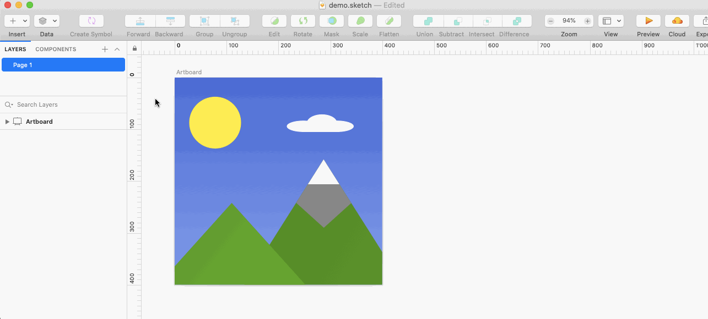
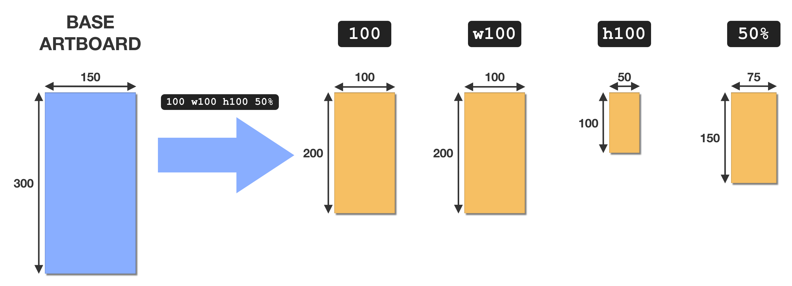

# Artboard Multi-Scale

A [Sketch](https://www.sketch.com/) plugin for scaling an Artboard to multiple dimensions in one sweep.


## Description

This plugin creates scaled copies of an Artboard in multiple dimensions. It also names and arranges the created Artboards in a sensible way:



The desired dimensions can be specified in terms of width, height, and percentage (see [_Dimensions_](#dimensions) below).

## Usage

The plugin is used as follows:

1. Select an Artboard.
1. Launch the plugin by selecting **Plugins > Artboard Multi-Scale** or pressing the **⌘⇧S** keyboard shortcut.
1. Enter the desired target dimensions (see [below](#dimensions)) and hit **OK**.

## Dimensions

The target dimensions are specified as a space-separated list of dimension specifiers. A dimension specifier specifies the desired width, height, or percentage that the Artboard should be scaled to.

The supported dimension specifiers are listed below:

| Format   | Example | Description |
|:--------:|:-------:|-------------|
| **`N`**  | **`50`**      | **`N`** is the desired width (height is determined automatically) |
| **`wN`** | **`w50`**     | **`N`** is the desired width (alias for the **`N`** format) |
| **`hN`** | **`h50`**     | **`N`** is the desired height (width is determined automatically) |
| **`N%`** | **`50%`**     | **`N`** is the desired percentage for width and height, relative to the base Artboard |

> Note that currently **`N`** must be an integer.

Dimension specifiers can be freely mixed in a given input, so, for example, `50 w50 h50 50%` is a valid input.

Below is a detailed example showing the effects of the different dimension specifiers.

### Example

Consider the following dimension specification input:

```
100 w100 h100 50%
```

If this is applied to an Artboard with a **width of 150** and a **height of 300**, the result is as shown below:



The effect of each dimension specifier is as follows:

- **`100`**: scales the Artboard to a **width of 100** and an automatically calculated **height of 200**.
- **`w100`**: scales the Artboard to a **width of 100** and an automatically calculated **height of 200** (alias for **`100`**).
- **`h100`**: scales the Artboard to a **height of 100** and an automatically calculated **width of 50**.
- **`50%`**: scales the Artboard to a an automatically calculated **width of 75** and **height of 150**.

## Development

To work on the plugin, the easiest way is to follow the below steps:

> Before proceeding, make sure to [uninstall the plugin](https://developer.sketch.com/plugins/#uninstalling-plugins), in case it's currently installed.

1. Clone the repository and `cd` into it:

    ```bash
    git clone https://github.com/weibeld/artboard-multi-scale
    cd artboard-multi-scale
    ```

2. Create a symlink from the [Sketch plugins directory](https://developer.sketch.com/plugins/#plugin-location) to the `.sketchplugin` bundle in the repository:

    ```bash
    ln -s \
      "$PWD"/artboard-multi-scale.sketchplugin \
      ~/Library/Application\ Support/com.bohemiancoding.sketch3/Plugins/artboard-multi-scale.sketchplugin
    ``` 

    > The above installs the plugin without moving the `.sketchplugin` bundle into the Sketch plugins directory. In this way, the plugin can be edited directly from within the repository directory.

3. Enable [plugin script reloading](https://developer.sketch.com/plugins/debugging#reload-scripts) in Sketch:

    ```bash
    defaults write com.bohemiancoding.sketch3 AlwaysReloadScript -bool YES
    ```

    > The above causes Sketch to always reload a plugin before executing it so that changes are reflected immediately. If this setting is disabled (which is the default), then Sketch must be restarted in order for changes to take effect.

4. Edit the plugin files in the `.sketchplugin` bundle, and test the changes by running the plugin in Sketch.

5. When done with editing, uninstall the plugin by deleting the previously created symlink:

    ```bash
    rm ~/Library/Application\ Support/com.bohemiancoding.sketch3/Plugins/artboard-multi-scale.sketchplugin
    ```

    > Do not uninstall the plugin through the Sketch UI (_Plugins > Manage Plugins..._) because this would delete the `.sketchplugin` bundle in the repository directory.
